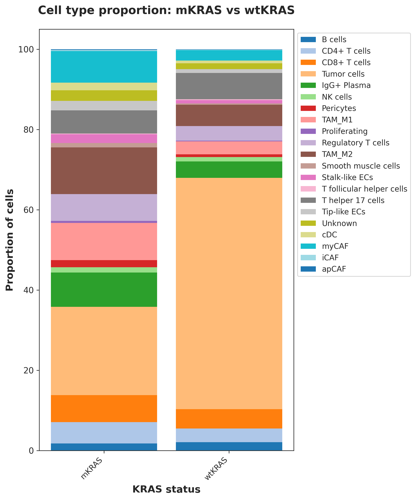
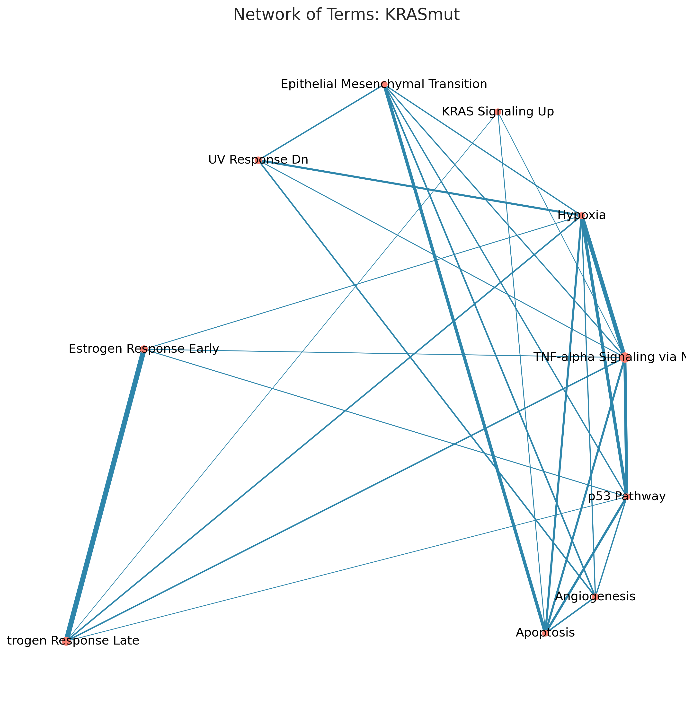
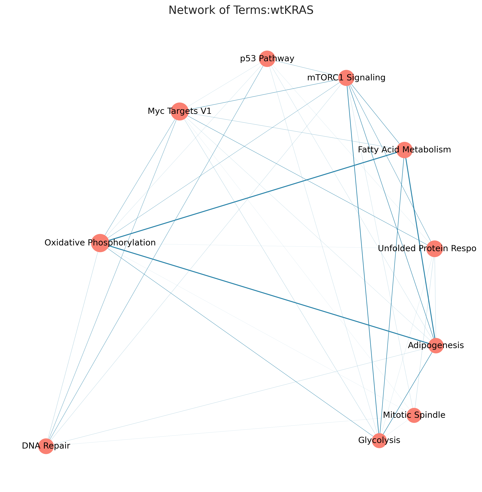
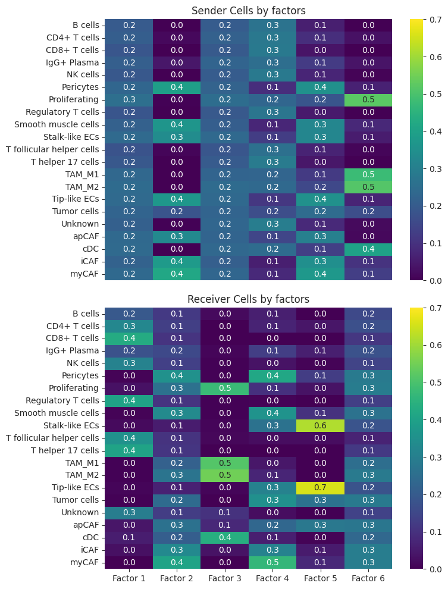
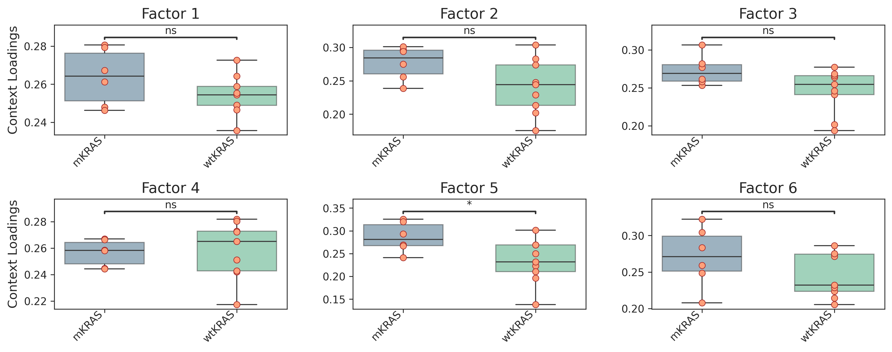
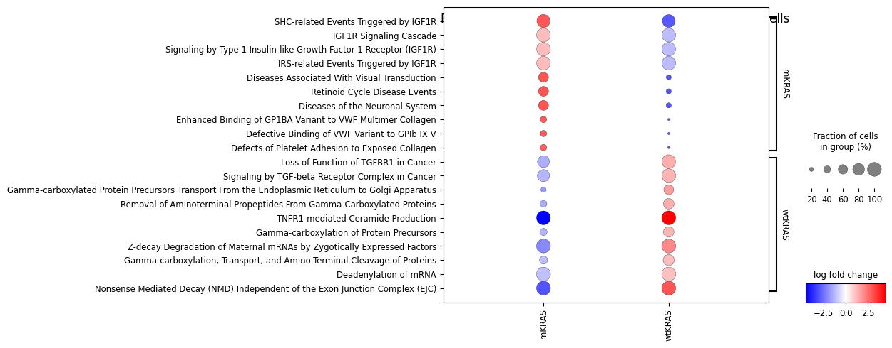
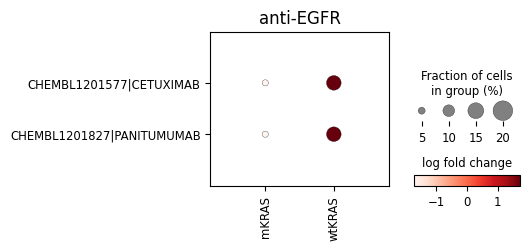
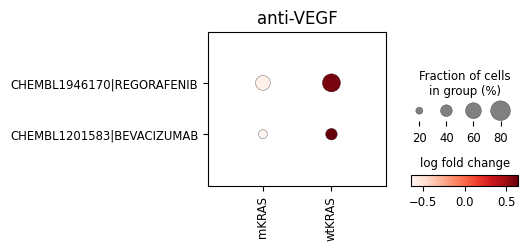
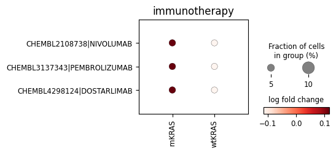
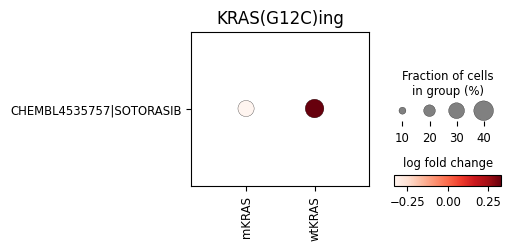

# scRNA-seq Analysis of Colorectal Cancer by KRAS Mutation Status

> Исследование гетерогенности опухолевых клеток колоректального рака (CRC) в зависимости от статуса мутации гена KRAS.
>
> Автор: **Ольга Магамедова**  
> Выполнено в рамках курса **«Анализ NGS-данных» BLASTIM**  
> Москва, апрель 2026

---

##  Описание проекта

Этот проект посвящён анализу single-cell RNA-seq данных колоректального рака (CRC) с целью сравнения опухолей с:

- **KRAS-mut** — опухоли с мутацией в гене KRAS
- **KRAS-wt** — опухоли с диким типом KRAS

Основная задача — выявить различия в:

- клеточном составе опухоли,
- транскрипционных программах опухолевых клеток,
- активности сигнальных путей,
- межклеточной коммуникации,
- потенциальных терапевтических мишенях.

---

##  Биологический контекст

Мутации гена **KRAS** встречаются у 30–50% пациентов с колоректальным раком и связаны с:

- более агрессивным течением заболевания;
- повышенным риском метастазирования;
- худшей общей выживаемостью;
- резистентностью к анти-EGFR терапии (цетуксимаб, панитумумаб).

KRAS-мутантные опухоли характеризуются конститутивной активацией сигнальных путей:

- MAPK/ERK
- PI3K/AKT

Это приводит к усилению пролиферации, EMT, ангиогенеза, воспаления и ремоделированию опухолевого микроокружения.

---

##  Цели исследования

1. Провести аннотацию клеточных типов.
2. Сравнить композицию клеточных популяций между KRAS-mut и KRAS-wt.
3. Выполнить differential expression analysis (DEG).
4. Исследовать гетерогенность опухолевых клеток с помощью Hotspot.
5. Провести ORA/GSEA анализ.
6. Изучить межклеточную коммуникацию.
7. Оценить активность сигнальных путей на уровне отдельных клеток.
8. Определить потенциальные клетки-мишени для терапии.

---
Исходные сырые данные взяты из публичного датасета [Lee et al. 2020](https://www.dropbox.com/scl/fi/6s8wo5wc311g5koz2nyep/Data_Lee2020_Colorectal.tar.gz?rlkey=lqfq6llcul4ghvhhl3ytxzk04&dl=1)
---

##  Используемые инструменты

### Основные библиотеки

- `scanpy`
- `pandas`
- `numpy`
- `matplotlib`
- `seaborn`

### Специализированные инструменты

- `Harmony` — batch correction
- `CellTypist` — автоматическая аннотация клеток
- `pertpy` / `scCODA` — композиционный анализ
- `Hotspot` — поиск коэкспрессированных модулей
- `gseapy` / `blitzgsea` — ORA и GSEA
- `liana` — анализ ligand-receptor взаимодействий
- `cell2cell` — оценка pathway enrichment для отдельных клеток
- `drug2cell` — прогноз потенциальной эффективности препаратов

---

##  Структура репозитория

```text
.
├── scRNAseq_CRC_KRAS.ipynb       # Основной ноутбук с анализом
├── SC_RNAseq_crc_KRAS.pptx       # Итоговая презентация
├── figures/                     # Графики и визуализации 
├── requirements.txt             # Список необходимых программ
└── README.md
```

---

##  Pipeline анализа

### 1. Предобработка данных

- загрузка матрицы экспрессии;
- фильтрация низкокачественных клеток;
- нормализация;
- выделение highly variable genes;
- PCA;
- batch correction с помощью Harmony;
- UMAP;
- кластеризация Leiden.

### 2. Аннотация клеток

Автоматическая аннотация выполнена с помощью `CellTypist`, затем вручную уточнена по маркерным генам.

### 3. Композиционный анализ

С использованием `scCODA` сравнивались доли клеточных типов между группами.

### 4. Differential Expression Analysis

Поиск генов, дифференциально экспрессированных между KRAS-mut и KRAS-wt опухолевыми клетками.

### 5. Hotspot Analysis

Выявление коэкспрессированных генных модулей.

### 6. Pathway Enrichment

ORA и GSEA для интерпретации биологических процессов.

### 7. Межклеточная коммуникация

Анализ ligand-receptor взаимодействий с помощью `liana`.

### 8. Cell-level pathway scoring

Оценка активности сигнальных путей для каждой клетки через `cell2cell`.

### 9. Drug Target Analysis

Поиск клеток-мишеней и оценка потенциальной эффективности препаратов с помощью `drug2cell`.

---

##  Основные результаты

###  Клеточный состав

В KRAS-mut опухолях наблюдается увеличение доли:

- myCAF
- apCAF
- iCAF
- перицитов
- TAM (tumor-associated macrophages)
- эндотелиальных клеток



---

###  Гетерогенность опухолевых клеток (Hotspot)

Выявлено 4 генных модуля:

| Модуль | Биологическая интерпретация |
|------:|-----------------------------|
| 1 | Небольшая группа tuft-like клеток с нейрональными и хемосенсорными программами |
| 2 | Пролиферативный модуль |
| 3 | Муцинозный модуль |
| 4 | Иммунный модуль |

---

###  Pathway Enrichment в KRAS-mut

Обогащены пути:

- EMT
- Angiogenesis
- Hypoxia
- NF-kB signaling
- Inflammatory response

Это указывает на более агрессивный и инвазивный фенотип.




---

###  Межклеточная коммуникация

Основные отправители сигналов:

- Перициты
- CAF (apCAF, iCAF, myCAF)
- Эндотелиальные клетки
- TAM

Основные получатели:

- Пролиферирующие опухолевые клетки
- TAM
- Эндотелиальные клетки

Ключевой фактор взаимодействий связан с **ангиогенезом**.




---

###  Cell2Cell

#### KRAS-mut

Повышена активность путей:

- growth factor signaling
- cell cycle

#### KRAS-wt

Преобладает:

- TGF-β signaling



---

###  Drug2Cell

Потенциально более эффективны в KRAS-wt:

- анти-VEGF терапия
- анти-EGFR моноклональные антитела

Не показали значимого эффекта:

- иммунотерапия
- Sotorasib (вероятно, из-за отсутствия KRAS G12C)





---

##  Заключение

Результаты подтверждают литературные данные:

- KRAS-мутантные опухоли обладают более агрессивным фенотипом.
- Активируются EMT, ангиогенез и воспалительные сигнальные пути.
- Происходит выраженное ремоделирование опухолевого микроокружения.
- Усиливаются межклеточные взаимодействия.
- Наблюдается худший прогноз и сниженная чувствительность к терапии.


